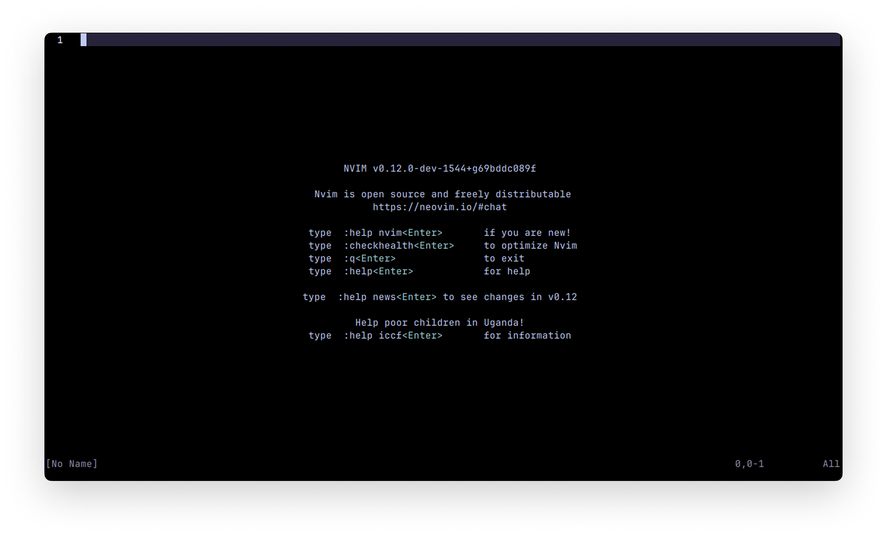
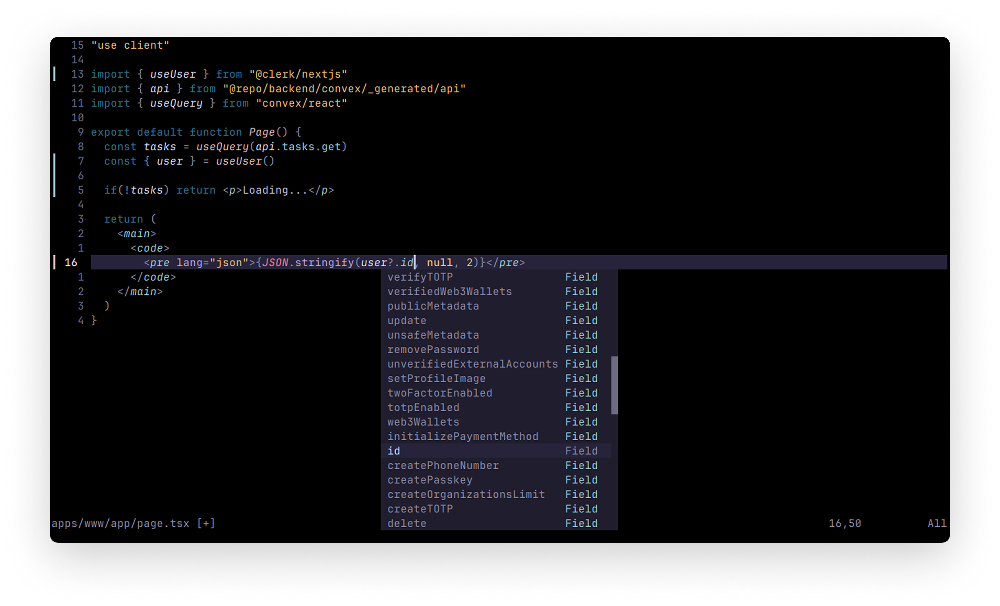
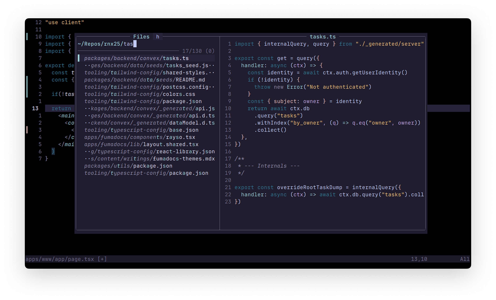

# LazyVim Neovim Configuration

A modern Neovim setup bootstrapped with LazyVim plugin manager, featuring LSP support, Treesitter syntax highlighting, and productivity enhancements.





## Features

- **Plugin Management**: Powered by [lazy.nvim](https://github.com/folke/lazy.nvim)
- **Language Support**:
  - Lua, JavaScript, TypeScript, CSS, HTML, JSON, Bash, Nix
  - LSP configuration for intelligent code completion
- **Syntax Highlighting**: Treesitter-based for accurate parsing
- **File Navigation**:
  - Nvim-tree file explorer
  - Oil.nvim file operations
  - Fzf-lua fuzzy finder
- **Code Formatting**: Conform.nvim with formatters for multiple languages
- **Color Scheme**: Rose Pine

## Installation

1. Clone this repository to your Neovim config directory:

   ```bash
   git clone https://github.com/Krish-Das/Dotfiles -b neovim ~/.config/nvim
   ```

2. Start Neovim:

   ```bash
   nvim
   ```

3. Lazy will automatically install all plugins on first launch.

## Requirements

- Neovim 0.8+
- Git
- Language servers (automatically managed by Mason)
